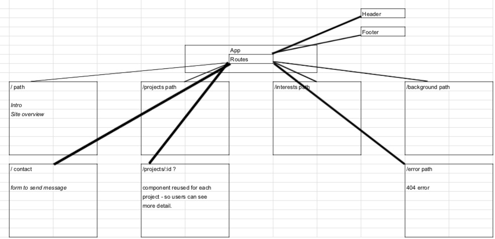
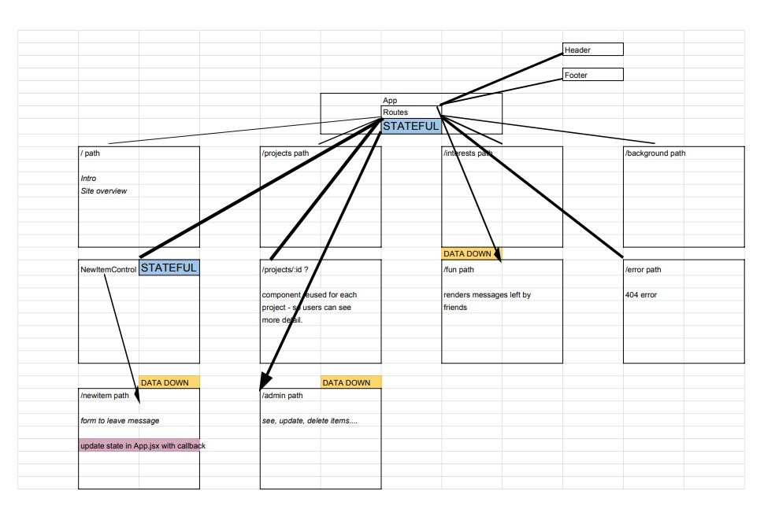

# CTC Portfolio

By Christopher Thomas Cahill

This project was bootstrapped with [Create React App](https://github.com/facebook/create-react-app).

### Run this project on your machine :

First clone this repository, then, in the project directory, you can run:

#### `npm start`

Runs the app in the development mode. 
Open [http://localhost:3000](http://localhost:3000) to view it in the browser.

The page will reload if you make edits. 
You will also see any lint errors in the console.

### Basic Outline of web app going forward :

### Updated Outline of web app including state :

